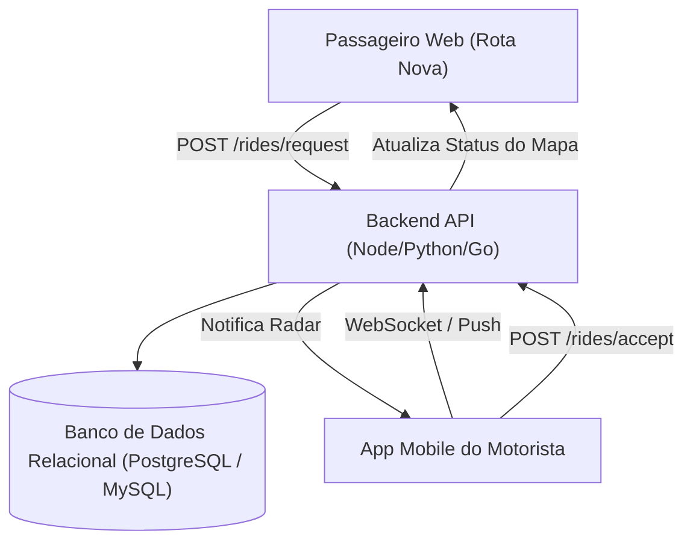

# Guia de Integração de Backend & Aplicativo Mobile — Rota Nova

Este documento fornece as especificações completas de arquitetura, banco de dados e endpoints de API para os desenvolvedores responsáveis pela conexão entre a plataforma Web do **Rota Nova** e o futuro **Aplicativo Mobile do Motorista / Passageiro**.

---

## 1. Arquitetura do Sistema



---

## 2. Banco de Dados

O script SQL completo com todas as tabelas, tipos de dados, chaves estrangeiras (`FOREIGN KEY`) e índices de busca está disponível no arquivo:
👉 **[`database_schema.sql`](file:///c:/projetos/RotaNova/database_schema.sql)**

### Principais Tabelas:
1. **`users`**: Cadastro de passageiros, motoristas e administradores.
2. **`driver_profiles`**: Dados específicos do motorista (modelo do carro, placa, CNH, aprovação no teste de conduta, nota, status online).
3. **`rides`**: Registro completo de cada corrida (origem, destino com latitude/longitude, categoria, preço, status, método de pagamento).
4. **`driver_financial_ledger`**: Lançamento financeiro detalhado de cada corrida (faturamento bruto, taxa de 10% da plataforma, estimativa de combustível e lucro líquido no bolso).
5. **`conduct_reports`**: Registro de denúncias e violações da regra de conduta (ex: recusa indevida de bairro).

---

## 3. Endpoints da API REST

Base URL recomendada: `https://api.rotanova.com.br/v1`

### A. Passageiro (Cliente)

#### 1. Solicitar Corrida
- **Rota:** `POST /rides/request`
- **Headers:** `Authorization: Bearer <jwt_token>`
- **Payload:**
```json
{
  "client_id": "usr_juliana",
  "origin_address": "Eixo Monumental, Bloco A — Brasília, DF",
  "origin_lat": -15.7934,
  "origin_lng": -47.8884,
  "destination_address": "Sol Nascente, Trecho 3, Chácara 28 — DF",
  "destination_lat": -15.8235,
  "destination_lng": -48.1130,
  "category": "pop", // 'pop' | 'comfort' | 'xl'
  "price": 24.50,
  "payment_method": "pix" // 'pix' | 'cartao' | 'dinheiro'
}
```
- **Resposta (201 Created):**
```json
{
  "success": true,
  "ride_id": "ROT-9041",
  "status": "searching",
  "created_at": "2026-08-27T23:30:00Z"
}
```

#### 2. Cancelar Corrida (Antes do embarque)
- **Rota:** `POST /rides/:id/cancel`
- **Payload:**
```json
{
  "reason": "troca_categoria_ou_endereco"
}
```

---

### B. Motorista (Condutor)

#### 1. Radar de Chamadas Ativas (Polling ou WebSocket)
- **Rota:** `GET /rides/radar?lat=-15.7934&lng=-47.8884&radius=10`
- **Resposta (200 OK):**
```json
{
  "active_calls": [
    {
      "ride_id": "ROT-9041",
      "client_name": "Juliana Mendes",
      "client_rating": 4.95,
      "pickup_address": "Eixo Monumental, Bloco A",
      "dropoff_address": "Sol Nascente, Trecho 3",
      "distance_km": 18.5,
      "price": 38.40,
      "category": "VIA GO"
    }
  ]
}
```

#### 2. Aceitar Corrida
- **Rota:** `POST /rides/:id/accept`
- **Payload:**
```json
{
  "driver_id": "drv_roberto"
}
```
- **Regra de Negócio:** Ao aceitar, o status muda para `in_transit` e a política *"Aceitou, Levou"* entra em vigor.

#### 3. Concluir Corrida & Creditar na Carteira
- **Rota:** `POST /rides/:id/complete`
- **Payload:**
```json
{
  "driver_id": "drv_roberto",
  "final_price": 38.40
}
```
- **Processamento Automático no Backend:**
  - `gross_amount`: R$ 38,40
  - `platform_fee` (10%): R$ 3,84
  - `fuel_estimate` (20%): R$ 7,68
  - `net_profit`: R$ 26,88

---

## 4. Integração Frontend

No frontend deste projeto, todas as assinaturas de chamadas já estão modularizadas em:
👉 **[`src/services/api.js`](file:///c:/projetos/RotaNova/src/services/api.js)**

Para conectar ao backend de produção, basta configurar a variável de ambiente:
```env
VITE_API_URL=https://api.rotanova.com.br/v1
```
